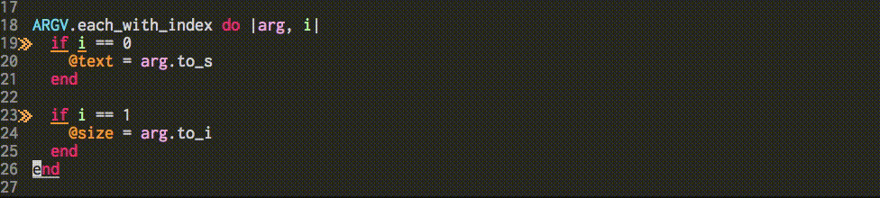

# rubocop-fix-file.el

Execute rubocop --auto-correct on Emacs silently



This Gif shows that `"` turns into `'` by executing `rubocop-fix-file`.

## Setup

```el
;; write the code as bellow in your init.el
(add-to-list 'load-path "/path/to/rubocop-fix-file.el")
(require 'rubocop-fix-file)
```

## Usage

You can execute commands bellow on *.rb file.

### rubocop-fix-file

It executes `rubocop --auto-correct --format emacs` on Emacs silently and fixes the code.
